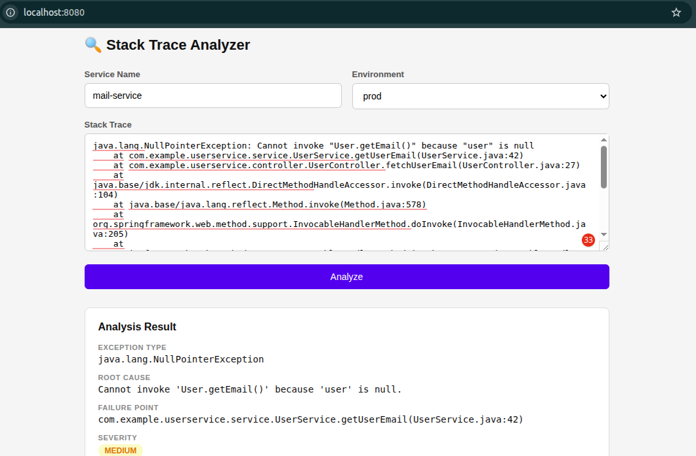

### AI-Powered Java Stack Trace Analyzer

A Spring Boot microservice that analyzes Java stack traces using an LLM and returns structured JSON output.

#### Tech Stack

- Java 21, Spring Boot 3
- Spring AI + Ollama (qwen2.5)
- Spring Data JPA + H2
- Maven

#### How to Run

```bash
# Set your Ollama URL
spring.ai.ollama.base-url=http://localhost:11434
spring.ai.ollama.chat.options.model=qwen2:1.5b
spring.ai.ollama.chat.options.temperature=0.1

#### Build and run
mvn clean package -DskipTests
java -jar target/app-1.0.0.jar
```

#### API

**POST** `/api/analyze`

```json
{
  "serviceName": "user-service",
  "environment": "prod",
  "stackTrace": "java.lang.NullPointerException ..."
}
```

Response:

```json
{
  "exceptionType": "java.lang.NullPointerException",
  "rootCause": "...",
  "failurePoint": "com.example.Service:88",
  "severity": "HIGH",
  "suggestedFix": ["step 1", "step 2"]
}
```

#### Project Structure

```
controller/   - REST endpoints
service/      - Business logic
ai/           - Ollama / Spring AI integration
dto/          - Request and response classes
entity/       - Incident JPA entity
repository/   - Spring Data JPA
exception/    - Error handling
```

